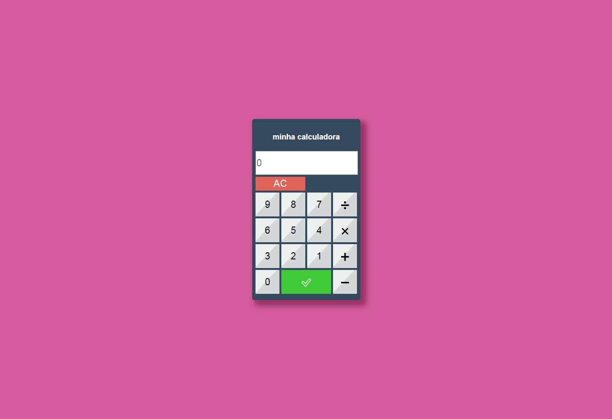

# calculator
 Em andamento...

## 🗒 Sobre:
Calculadora sendo construida pra uso didatico.

## 🔨 Tecnologias:
- HTML
- CSS
- JavaScript

## 📚 Requisitos:
- Nenhuma

## 🏁 Como executar o projeto:
1 Baixe ou clone o repositorio.
2 Execute o arquivo index.html
- Elemento
* Elemento
Elemento
Elemento
